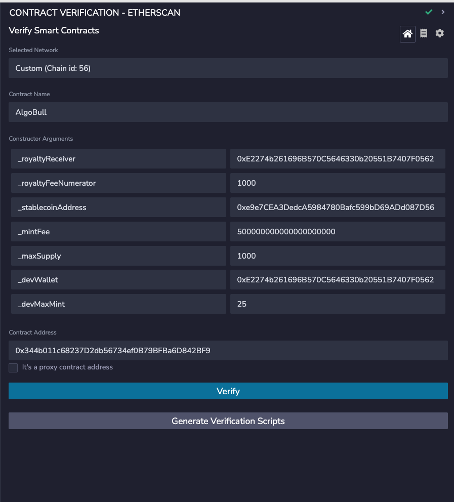
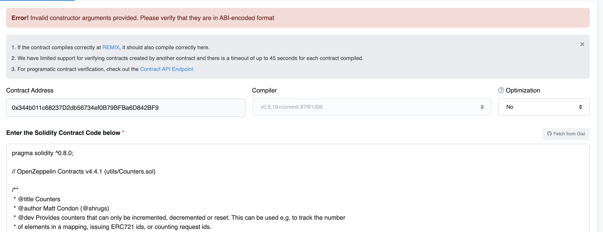

# Verification Attempts

In effort to successfully verify the [AlgoBull](https://bscscan.com/address/0x344b011c68237D2db56734ef0B79BFBa6D842BF9) we've tried the following:

1. Running this foundry script:
```shell
forge verify-contract \
    --chain-id 56 \
    --constructor-args $(cast abi-encode "constructor(address,uint96,address,uint256,uint256,address,uint256)" 0xE2274b261696B570C5646330b20551B7407F0562 1000 0xe9e7CEA3DedcA5984780Bafc599bD69ADd087D56 500000000000000000000 1000 0xE2274b261696B570C5646330b20551B7407F0562 25) \
    --etherscan-api-key $BNB_SCAN_API_KEY \
    --compiler-version "v0.8.18+commit.87f61d96" \
    0x344b011c68237D2db56734ef0B79BFBa6D842BF9 \
    src/AlgoBull.sol:AlgoBull \
    --watch
```
Results in:
```shell
Details: `Fail - Unable to verify. Compiled contract deployment bytecode does NOT match the transaction deployment bytecode.`
Contract failed to verify.
```

2. Running verification in Remix:
   

results the following console error:
```
vendor.plugin-etherscan.1689606243349.js:1 Warning: An unhandled error was caught from submitForm() Error: value out-of-bounds (argument=null, value="0x00000000000000000000000000000000000000000000000000000000E2274b261696B570C5646330b20551B7407F0562", code=INVALID_ARGUMENT, version=abi/5.7.0)
```

3. Running at [bscscan verification on the web](https://bscscan.com/verifyContract?a=0x344b011c68237D2db56734ef0B79BFBa6D842BF9), results in the following error:
   